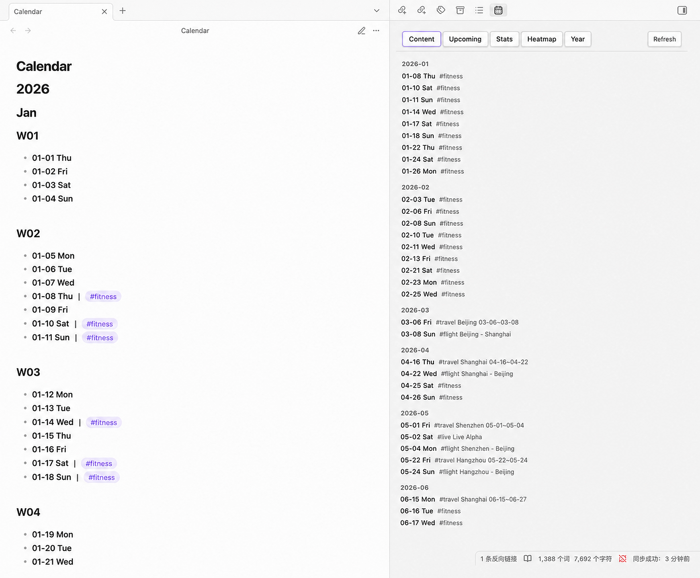
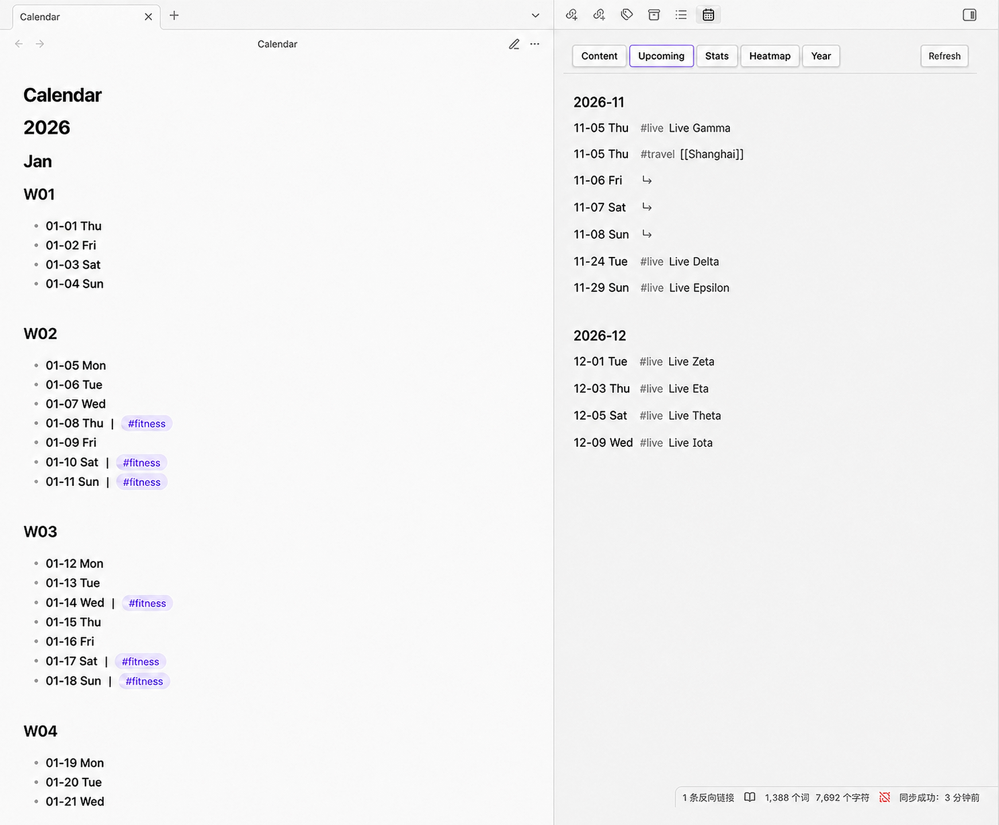
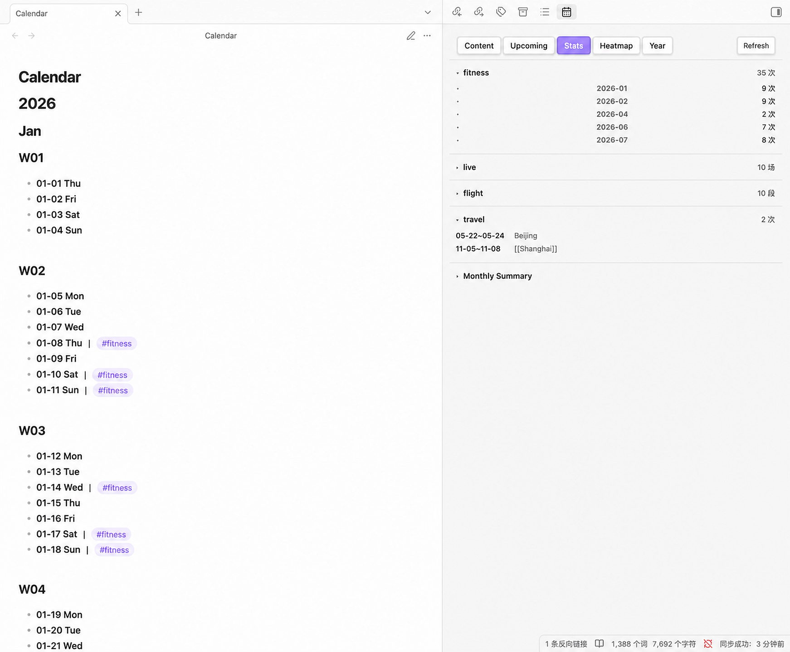
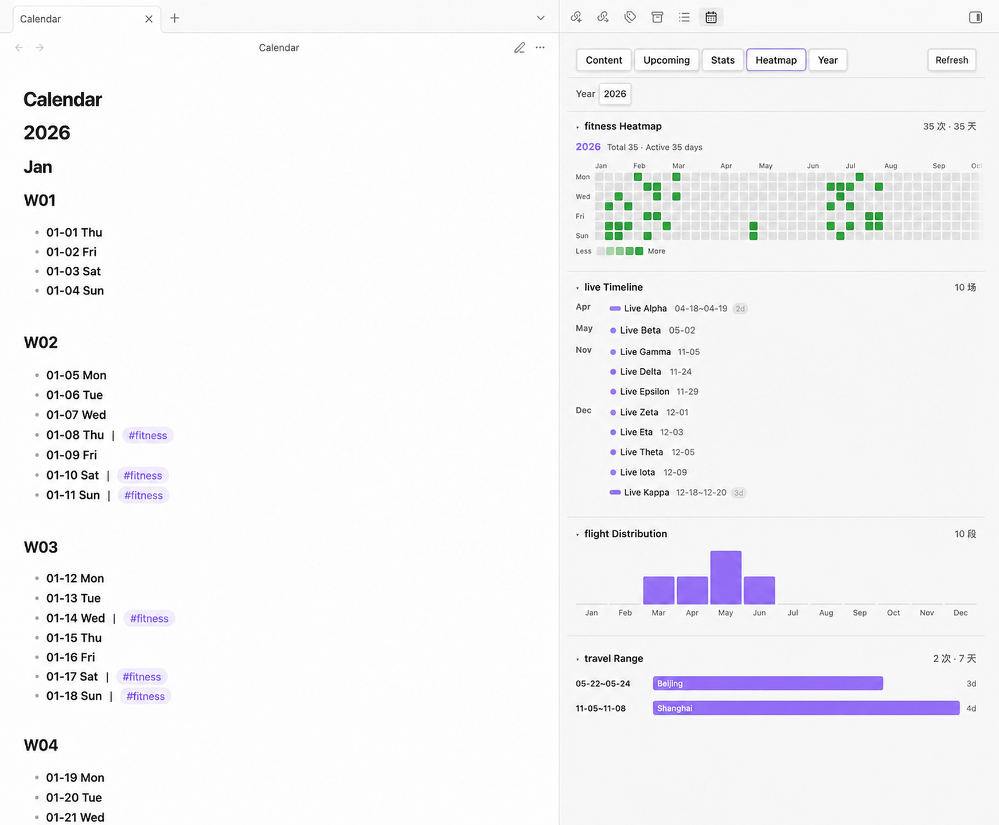
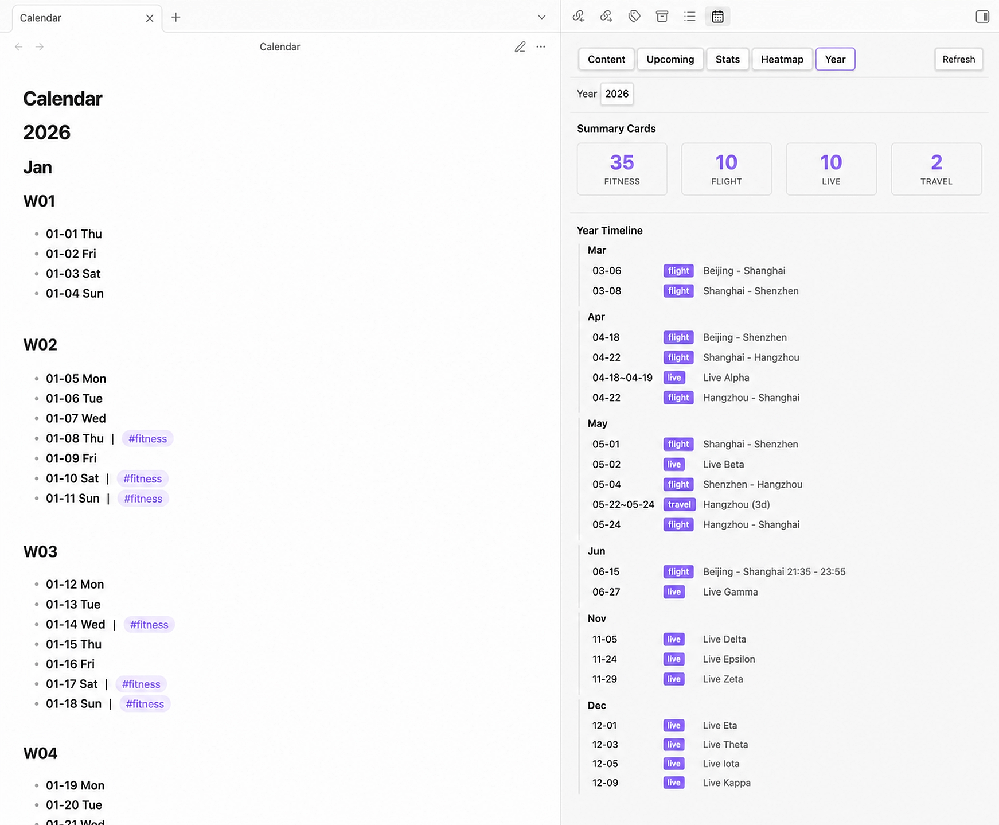

# Calendar Ledger

中文版 | [English](README.md)

Calendar Ledger 是一款 Obsidian 插件，用一个普通的 Markdown 文件管理连续多年的日历、记录、标签、链接和日期范围，并提供快速导航、行内记录、侧边栏大纲、统计、热力图和年度汇总。

## 功能

- 生成覆盖任意起止年份的连续日历。
- 所有记录保存在一个普通 Markdown 文件中，无需额外数据库。
- 在侧边栏中提供 Content、Upcoming、Stats、Heatmap 和 Year 五个视图。
- 通过命令面板跳转到今天或指定日期，并向今天或指定日期添加记录。
- 支持生成中文或英文星期。
- 可选择周一或周日作为可视化布局的一周起始日。
- 可显示或隐藏 ISO 周标题（`W01`、`W02` 等）。
- 支持多个标签、Obsidian 双向链接和日期范围。
- 按标签显示活动热力图、事件时间线、月度分布和日期范围视图。
- 分别统计日期范围事件数量和去重后的覆盖天数。
- 将旧的嵌套日期结构迁移为当前行内格式，并保留原有文本、链接和标签。
- 日历文件变化时自动刷新侧边栏。

## 界面截图

### 内容



### 即将发生



### 统计



### 热力图



### 年度



## 安装

### 社区插件

在 Obsidian 中打开 **设置 → 第三方插件 → 浏览**，搜索 **Calendar Ledger**，然后安装并启用。

### BRAT 或手动安装

测试版本可以通过 BRAT 安装本 GitHub 仓库。手动安装时，请从 Release 下载 `main.js`、`manifest.json` 和 `styles.css`，并放入：

```text
.obsidian/plugins/calendar-ledger/
├── manifest.json
├── main.js
└── styles.css
```

随后重新加载 Obsidian，并在 **设置 → 第三方插件** 中启用 **Calendar Ledger**。

## 快速开始

1. 安装并启用 **Calendar Ledger**。
2. 打开 **设置 → Calendar Ledger**。
3. 设置日历文件路径，默认为 `Calendar.md`。
4. 选择起始年份、结束年份、星期语言、一周起始日和周数显示方式。
5. 在命令面板中运行 **Generate calendar file**。
6. 点击日历功能区图标，或运行 **Open calendar outline** 打开插件侧边栏。
7. 使用 **Add item to today** 或 **Add item to specified date** 添加记录。

执行迁移或覆盖命令前，请先备份日历文件。

## 日历格式

生成的文件使用标准 Markdown 标题和日期列表项。典型记录如下：

```markdown
# 2026

## 7月

### W30

- **07-20 周一** ｜ #旅行 北京 [[旅行笔记]] 07-20～07-25； #健身 跑步
- **07-21 周二** ｜ #生活 音乐会
```

格式规则：

- `# 年份`、`## 月份` 和可选的 `### Wxx` 标题构成日历结构。
- 日期行使用 `- **MM-DD 星期**`，年份继承自最近的年份标题。
- 日期标记与第一条记录之间使用全角分隔符 ` ｜ `。
- 同一天的多条独立记录之间使用中文分号 `；`。
- 标签使用 `#标签`；标签后的文本会作为统计中的记录内容。
- 支持 `[[旅行笔记]]` 形式的 Obsidian 双向链接。
- 日期范围支持 `07-20～07-25` 或 `07-20～07～25` 等形式。

解析器也支持旧的标题式和嵌套列表格式。可以使用 **Migrate to latest format** 将已有文件转换为当前格式。

## 侧边栏视图

- **Content**：按月份列出所有包含记录的日期，点击记录可跳转到源文件对应行。
- **Upcoming**：显示未来记录，以及未来日期范围所覆盖的日期。
- **Stats**：显示已启用标签的记录数量、记录天数、事件列表和月度汇总。
- **Heatmap**：显示基于标签的活动热力图、事件时间线、月度分布和日期范围。
- **Year**：显示所选年份的记录天数汇总、自定义汇总卡片、时间线和标签概览。

## 设置

- **Calendar file path**：仓库内的相对路径，例如 `Calendar.md` 或 `Journal/Calendar.md`。
- **Start year / End year**：控制生成日历的年份范围；追加年份时会自动延长结束年份。
- **Week starts on**：设置热力图和可视化布局从周一或周日开始。日历中的周标题始终采用周一开始的 ISO 周。
- **Calendar content language**：设置生成日期行中的星期为中文或英文。
- **Show week number**：添加或移除 `Wxx` 标题，同时保留已有记录并更新日历结构。
- **Stats tags**：选择在 Stats 视图中显示的标签。
- **Visualization tag mappings**：将标签映射为 Activity、Event、Monthly、Range 或 None，并可设置显示名称。
- **Year Summary cards**：选择在 Year 视图中显示的记录天数和标签卡片。

## 命令

- **Generate calendar file**：当配置的文件不存在时创建日历。
- **Overwrite calendar file**：确认后重建日历。此操作可能替换现有记录，请先备份。
- **Append year**：在日历末尾追加下一年。
- **Jump to today**：跳转到今天。
- **Jump to specified date**：输入 `7-30` 或 `2026-7-30` 等日期并跳转。
- **Add item to specified date**：在指定日期插入行内记录。
- **Add item to today**：在今天插入行内记录。
- **Migrate to latest format**：将旧的嵌套记录或空格分隔记录转换为当前行内格式。
- **Open calendar outline**：打开插件侧边栏。

## 兼容性

- Obsidian 最低版本：`1.7.2`
- 支持桌面端和移动端（`isDesktopOnly: false`）
- MIT License

## 反馈与贡献

请在 [millioncheung/calendar-ledger](https://github.com/millioncheung/calendar-ledger/issues) 提交 Issue，并附上 Obsidian 版本、插件版本、经过脱敏的简短日历示例以及控制台错误信息。

欢迎提交 Pull Request。
